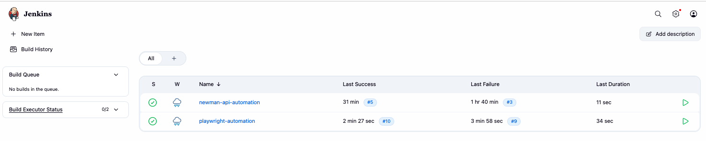

# 🐳 Jenkins Shared Docker Image

A centralized Jenkins Docker image pre-installed with all tools needed to run multiple automation projects — including **Newman (API)**, **Playwright (Web & API)**, and **Robot Framework + Appium (Mobile)** — without switching images between projects.

---

## 📋 Overview

Instead of maintaining a separate Dockerfile per project, this repo provides a **single shared Jenkins image** that supports all automation projects in one place.

```
jenkins-shared/
└── JenkinsDockerfile       ← Single Dockerfile with all tools pre-installed
```

---

## 🛠️ What's Included

| Tool | Purpose |
|------|---------|
| Jenkins LTS | CI/CD platform |
| Node.js 18 | JavaScript runtime |
| Python 3 + pip3 | Required for Robot Framework |
| Newman | Run Postman collections in CLI |
| newman-reporter-html | HTML report for Newman |
| Playwright | Web & API test framework |
| Chromium | Browser for Playwright tests |
| System dependencies | Required libs for Chromium to run headless |

> **Note:** Robot Framework and Appium Library are installed at pipeline runtime (not in the image) to keep the image flexible across projects.

---

## 🚀 Getting Started

### Step 1: Clone this repo

```bash
git clone https://github.com/sipahtsanan/jenkins-shared.git
cd jenkins-shared
```

### Step 2: Build the Docker image

```bash
docker build -t my-jenkins-shared -f JenkinsDockerfile .
```

> This may take a few minutes on first build as it installs browsers and dependencies.

### Step 3: Run Jenkins

```bash
docker run -d --name jenkins \
  -p 8080:8080 \
  -p 50000:50000 \
  -v jenkins_home:/var/jenkins_home \
  -v /var/run/docker.sock:/var/run/docker.sock \
  -e JAVA_OPTS="-Dorg.jenkinsci.plugins.durabletask.BourneShellScript.HEARTBEAT_CHECK_INTERVAL=86400" \
  my-jenkins-shared
```

### Step 4: Access Jenkins

Open [http://localhost:8080](http://localhost:8080) in your browser.

To get the initial admin password:

```bash
docker exec jenkins cat /var/jenkins_home/secrets/initialAdminPassword
```

---

## 🔄 Updating the Image

When you need to add new tools, update `JenkinsDockerfile`, then rebuild:

```bash
docker stop jenkins && docker rm jenkins
docker build -t my-jenkins-shared -f JenkinsDockerfile .
docker run -d --name jenkins \
  -p 8080:8080 -p 50000:50000 \
  -v jenkins_home:/var/jenkins_home \
  -v /var/run/docker.sock:/var/run/docker.sock \
  -e JAVA_OPTS="-Dorg.jenkinsci.plugins.durabletask.BourneShellScript.HEARTBEAT_CHECK_INTERVAL=86400" \
  my-jenkins-shared
```

> Your Jenkins jobs, configs, and credentials are stored in the `jenkins_home` volume and will be preserved after rebuild.

---

## 📦 Projects Using This Image

| Project | Repository | Test Type | Language/Framework |
|---------|-----------|-----------|-------------------|
| API Automation | [API-automation-project-folder](https://github.com/sipahtsanan/API-automation-project-folder) | API | Postman / Newman |
| Playwright Automation | [Playwright-Practice-Project](https://github.com/sipahtsanan/Playwright-Practice-Project) | Web UI & API | TypeScript / Playwright |
| Mobile Automation | [Mobile-automation-project-folder](https://github.com/sipahtsanan/Mobile-automation-project-folder) | Android Mobile | Python / Robot Framework + Appium |

---

## 📱 Mobile Testing Prerequisites (Robot Framework + Appium)

Mobile tests require additional setup on your **Mac host** before running the pipeline.

### 1. Install Appium on Mac

```bash
npm install -g appium
appium driver install uiautomator2
```

### 2. Start Appium Server

```bash
appium --address 0.0.0.0 --port 4723
```

### 3. Start Android Emulator

```bash
# List available AVDs
emulator -list-avds

# Start emulator
emulator -avd <your_avd_name>
```

### 4. Prepare APK file on Mac

The APK file must be accessible on your **Mac host** (not inside Docker) because Appium runs on Mac and needs direct file access.

Download the APK from the Mobile project repo:
[Minimal_To_Do.apk](https://github.com/sipahtsanan/Mobile-automation-project-folder/blob/main/app/Minimal_To_Do.apk)

Then place it on your Mac:

```bash
mkdir -p ~/appium-apps
cp /path/to/Minimal_To_Do.apk ~/appium-apps/
```

### 5. Build Now with APK_PATH parameter

When triggering the `robot-mobile-automation` pipeline in Jenkins, fill in the `APK_PATH` parameter with the absolute path to the APK on your Mac:

```
/Users/<your-username>/appium-apps/Minimal_To_Do.apk
```

> Check your username with `whoami` in terminal.

---

## 📊 Jenkins Dashboard



---

## ⚠️ Notes

- The `-v jenkins_home:/var/jenkins_home` flag is important — it persists all Jenkins data across container restarts and rebuilds.
- The `HEARTBEAT_CHECK_INTERVAL` Java option prevents a known Jenkins issue (`JENKINS-48300`) on macOS with Docker volumes that causes pipelines to fail with `exit code -1`.
- Playwright browsers are installed at image build time, so pipelines only need to run `npx playwright install chromium` (no `--with-deps`) to link them.
- Mobile tests require Appium Server and Android Emulator to be running on Mac **before** triggering the pipeline.
